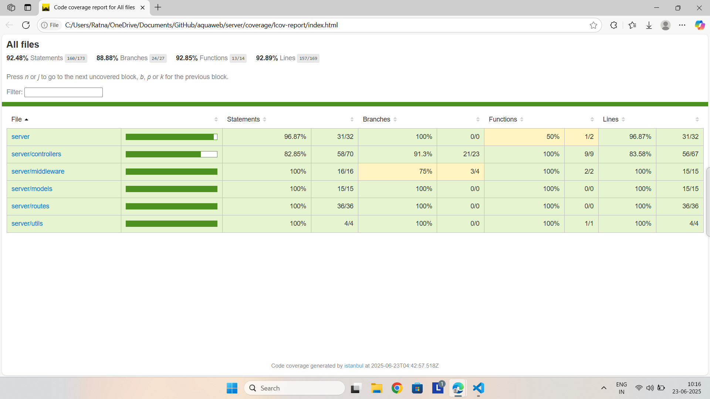

# 🌊 AquaWeb - Backend (Express + MongoDB)

AquaWeb is a **citizen science web application** for marine biodiversity awareness and whale-watching activities. This backend is built using **Node.js**, **Express**, and **MongoDB**, and aligns with the research paper: _"Aqua: Leveraging Citizen Science to Enhance Whale-Watching Activities and Promote Marine-Biodiversity Awareness"_.

---

## 📦 Tech Stack
- **Node.js** + **Express** – Backend server
- **MongoDB** – NoSQL database
- **JWT** – Authentication
- **Jest + Supertest** – Automated API testing

---

## 📁 Project Structure
```
server/
├── config/             # DB connection config
├── controllers/        # Feature logic
├── middleware/         # Auth, error handling
├── models/             # MongoDB schemas
├── routes/             # API routes
├── utils/              # Token generation, helpers
├── tests/              # Automated test cases
├── uploads/            # (Optional) uploaded media
├── .env                # Secrets (not committed)
├── app.js              # Express app
├── server.js           # App entry point
└── README.md
```

---

## 🔐 Environment Variables
Create a `.env` file in `server/`:
```env
PORT=5000
MONGO_URI=mongodb://localhost:27017/aquaweb
JWT_SECRET=your_super_secret
```

---

## 🚀 Getting Started
```bash
cd server
npm install
npm start
```

Backend will run on: `http://localhost:5000`

---

## 🧪 Run Tests & Generate Coverage
```bash
npm install --save-dev jest supertest dotenv
npm run test:coverage
```

Then to preview HTML report:
```bash
npx serve coverage/lcov-report
```

---

## ✅ Sample APIs
| Method | Endpoint              | Description          |
|--------|-----------------------|----------------------|
| POST   | `/api/auth/register` | Register new user    |
| POST   | `/api/auth/login`    | Login & get token    |
| GET    | `/api/users/me`      | Get logged-in user   |
| POST   | `/api/trips/start`   | Begin a trip session |
| PUT    | `/api/trips/end/:id` | End a trip           |
| POST   | `/api/sightings`     | Submit a sighting    |
| GET    | `/api/sightings`     | All sightings        |
| POST   | `/api/incidents`     | Report an incident   |
| GET    | `/api/species`       | Get species list     |

---

## 📊 Test Coverage Screenshot

---

## 🧠 Credits
Based on research: `Aqua: Leveraging Citizen Science...`
Built with ❤️ by [Ratnakar Yadav](https://github.com/ratn7921)
